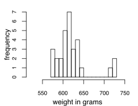

------------------------------

[Back to Index](Q_index.html)

------------------------------


## Thermometer Calibration

For Questions 1-6, consider the thermometer calibration problem from the quiz in Lesson 6.

Suppose you are trying to calibrate a thermometer by testing the temperature it reads when water begins to boil. Because of natural variation, you take $n$ independent measurements (experiments) to **estimate $\theta$, the mean temperature reading for this thermometer at the boiling point**. Assume a normal likelihood for these data, with mean $\theta$ and known variance $\sigma^2 = 0.25$ (which corresponds to a standard deviation of 0.5 degrees Celsius).

Suppose your prior for $\theta$ is (conveniently) the conjugate normal. You know that at sea level, water should boil at 100 degrees Celsius, so you set the prior mean at $m_0=100$.


### Question 1

If you specify a prior variance $s_0^2$ for $\theta$, which of the following accurately describes the model for your measurements $Y_i$, $i=1,\ldots,n$?


* Likelihood $Y_i \mid \theta \overset{\text{iid}}{\sim} N(\theta,0.25)$
* Prior $\theta \sim \text{N}(100, s_0^2)$

### Question 2

You decide you want the prior to be equivalent (in effective sample size) to one measurement.

What value should you select for $s_0^2$ the prior variance of $\theta$? Round your answer to two decimal places.


* $n_{eff} = \frac{\sigma^{2}_{0}}{s^{2}_{0}} = 1$ and $\sigma^{2}_{0} = 0.25 \rightarrow s^{2}_{0} = 0.25$


### Question 3

You collect the following $n=5$ measurements: (94.6, 95.4, 96.2, 94.9, 95.9).

What is the posterior distribution for $\theta$?

* $\theta \mid x = 
    N\Bigg(
      \frac{\frac{ n\bar{x} }{ \sigma_{0}^{2} } + \frac{m_0}{ s_{0}^{2} }}{\frac{n}{\sigma_{0}^{2} } + \frac{1}{s_{0}^{2}}},          \frac{1}{\frac{n}{\sigma_{0}^{2}} + \frac{1}{s_{0}^{2}}}
    \Bigg)$

```{r}
m.0 = 100
sigma.sq = 0.25
s.sq = 0.25

x = c(94.6, 95.4, 96.2, 94.9, 95.9)
x.bar = mean(x)
x.bar

n = length(x)
n

post.mean.mu = ( (n * x.bar / sigma.sq) + (m.0 / s.sq) ) / ( (n / sigma.sq) + (1 / s.sq) )
post.mean.mu = round(post.mean.mu, 2)
post.mean.mu

post.variance.mu = (1) / ((n / sigma.sq) + (1 / s.sq))
post.variance.mu = round(post.variance.mu, 3)
post.variance.mu

```

* **$N(96.17, 0.42)$**


```{r}
post.sd.mu = sqrt(post.variance.mu)
prior.sd.mu = sqrt(s.sq)
lwb = 95 #post.mean.mu - 3.5 * post.sd.mu
upb = 102 #post.mean.mu + 3.5 * post.sd.mu
x = seq(lwb, upb, 0.0001)
legend_labels = c(expression(post. ~ N(96.17, 0.042)),
                  expression(prior ~ N(100, 0.25)))


plot(x, dnorm(x, mean=post.mean.mu, sd=post.sd.mu), type='l', lty=1, lwd=2, col='darkorange',
     xlab = "Temperature Celsius",  ylab = "Distribution",
     main = "Thermometer Calibration")
lines(x, dnorm(x, mean=m.0, sd=prior.sd.mu), lty=2, lwd=2, col="darkblue")
legend(99.25, 1.95, legend = legend_labels, col=c("darkorange", "darkblue"), lty=c(1, 2), lwd=2)

```


### Question 4

Use R or Excel to find the upper end of a 95% equal-tailed credible interval for $\theta$.

```{r}
qnorm(0.975, post.mean.mu, sqrt(post.variance.mu))
```


```{r}
post.sd.mu = sqrt(post.variance.mu)
lwb = post.mean.mu - 5.5 * post.sd.mu
upb = post.mean.mu + 5.5 * post.sd.mu
x = seq(lwb, upb, 0.0001)

plot(x, dnorm(x, mean=post.mean.mu, sd=post.sd.mu), type='l', lty=1, lwd=2, col='darkorange',
     xlab = expression("Temperature in Celsius Degrees"),  ylab = "Posterior Predictive Distribution",
     main = expression("Thermometer Calibration. Posterior "~ theta ~"|"~ X ~ "~" ~ N(96.17, 0.042)))
abline(v=qnorm(.975, 96.17, sqrt(post.variance.mu)), col="grey", lty=3, lwd=2.5)
```


### Question 5

After collecting these data, is it reasonable to conclude that the thermometer is biased toward low values?


```{r}
pnorm(100, post.mean.mu, post.sd.mu)

```

* Yes, we have $P(\theta < 100 \mid \mathbf{y}) > 0.9999$


### Question 6
What is the posterior predictive distribution of a single future observation $Y^*$?


* Prior Predictive Distribution: $X \sim N(\mu_0 , s_{0}^{2} + \sigma_{0}^{2} ) \rightarrow N(100,~ 0.5)$

* **Posterior Predictive Distribution** $\rightarrow$ update $\mu_0$ and $s_{0}^{2} \rightarrow N(96.17,~ 0.292)$


```{r}

var.post.pred = post.variance.mu + sigma.sq
var.prio.pred = s.sq + sigma.sq
lwb = 93 #post.mean.mu - 5.5 * sqrt(var.post.pred)
upb = 105 #post.mean.mu + 5.5 * sqrt(var.post.pred)
x = seq(lwb, upb, 0.0001)

legend_labels = c(expression("post. pred" ~ N(96.17, 0.292)),
                  expression("prior pred" ~ N(100, 0.5)))


plot(x, dnorm(x, mean=post.mean.mu, sd=sqrt(var.post.pred)), type='l', lty=1, lwd=2, col='green',
     xlab = "Y in Celsius Degrees",  ylab = "Predictive Distribution",
     main = expression("Predictive Distribution of " ~ Y^"*" ))
lines(x, dnorm(x, m.0, sqrt(var.prio.pred)), lty=2, lwd=2, col="cyan")
legend(99.65, 0.75, legend = legend_labels, col=c("green", "cyan"), lty=c(1, 2), lwd=2)


```


## Restaurants 

For Questions 7-10, consider the following scenario:

Your friend moves from city A to city B and is delighted to find her favorite restaurant chain at her new location. After several meals, however, she suspects that the restaurant in city B is less generous. She decides to investigate.

She orders the main dish on 30 randomly selected days throughout the year and records each meal's weight in grams. You still live in city A, so you assist by performing the same experiment at your restaurant. Assume that the dishes are served on identical plates (measurements subtract the plate's weight), and that your scale and your friend’s scale are consistent.


### Question 7

The following histogram shows the 30 measurements from Restaurant B taken by your friend.



Is it reasonable to assume that these data are normally distributed?

* **No, there appear to be a few extreme observations (outliers)**


### Question 8

Your friend investigates the three observations above 700 grams and discovers that she had ordered the incorrect meal on those dates. She removes these observations from the data set and proceeds with the analysis using $n=27$.

She assumes a normal likelihood for the data with unknown mean $\mu$ and unknown variance $\sigma^2$.
She uses the model presented in Lesson 10.2 where, conditional on $\sigma^2$, the prior for $\mu$ is normal with mean $m$ and variance $\sigma^2/w$.
Next, the marginal prior for $\sigma^2$ is $\text{Inverse-Gamma}(a,b)$.

Your friend's prior guess on the mean dish weight is 500 grams, so we set $m=500$.
She is not very confident with this guess, so we set the prior effective sample size $w=0.1$.
Finally, she sets $a=3$ and $b=200$.

We can learn more about this inverse-gamma prior by simulating draws from it. If a random variable $X$ follows a $\text{Gamma}(a,b)$ distribution, then $\frac{1}{X}$ follows an $\text{Inverse-Gamma}(a,b)$ distribution.
Hence, we can simulate draws from a gamma distribution and take their reciprocals, which will be draws from an inverse-gamma.

=> Simulate a large number of draws (at least 300) from the prior for $\sigma^2$ and report your approximate prior mean from these draws. It does not need to be exact.


* $\mu \,\mid\, \sigma^2 \sim N(500,\, \sigma^2/w)$
* $\sigma^2 \sim \Gamma^{-1}(3,~200)$


```{r}
a = 3
b = 200
sigma.prior.draws <- 1 / rgamma(n=1000, shape=a, rate=b)
mean(sigma.prior.draws)

```

### Question 9

With the $n=27$ data points, your friend calculates the sample mean $\bar{y} = 609.7$ and sample variance $s^2 = \frac{1}{n-1} \sum(y_i - \bar{y})^2 = 401.8$.

Using the update formulas from Lesson 10.2, she calculates the following posterior distributions:

$\sigma^2 \mid \mathbf{y} \sim \text{Inverse-Gamma}(a', b')$

$\mu \mid \sigma^2, \mathbf{y} \sim \text{N}(m', \frac{\sigma^2}{w+n})$

where

$a' = a + \frac{n}{2} = 3 + \frac{27}{2} = 16.5$

$b' = b + \frac{n-1}{2} s^2 + \frac{wn}{2(w+n)}(\bar{y}-m)^2 = 200 + \frac{27-1}{2} 401.8 + \frac{0.1\cdot 27}{2(0.1+27)}(609.7-500)^2 = 6022.9$

$m' = \frac{n\bar{y} + wm}{w + n} = \frac{27\cdot 609.7 + 0.1\cdot 500}{0.1 + 27} = 609.3$

$w=0.1$, and $w+n=27.1$.

To simulate draws from this posterior, begin by drawing values for $\sigma^2$ from its posterior using the method from the preceding question. Then, plug these values for $\sigma^2$ into the posterior for $\mu$ and draw from that normal distribution.


```{r}
a.prime = 16.5
b.prime = 6022.9
sig2.B <- 1/ rgamma(n=1000, shape=a.prime, rate=b.prime)
mean(sig2.B)

```
```{r}
w = 0.1
n.B = 27
m.prime = 609.3
mu.B <- rnorm(1000, mean=m.prime, sd=sqrt(sig2.B/(w + n.B)))
mean(mu.B)
```


We can use these simulated draws to help us approximate inferences for $\mu$ and $\sigma^2$. For example, we can obtain a 95% equal-tailed credible for $\mu$ by calculating the quantiles/percentiles of the simulated values.


```{r}
quantile(x=mu.B, probs=c(0.025, 0.975))
```

* **$(602, 617)$**


### Question 10

You complete your experiment at Restaurant A with $n=30$ data points, which appear to be normally distributed. You calculate the sample mean $\bar{y} = 622.8$ and sample variance $s^2 = \frac{1}{n-1} \sum(y_i - \bar{y})^2 = 403.1$.

Repeat the analysis from Question 9 using the same priors and draw samples from the posterior distribution of $\sigma_A^2$ and $\mu_A$ (where the $A$ denotes that these parameters are for Restaurant A).

Treating the data from Restaurant A as independent from Restaurant B, we can now attempt to answer your friend's original question: is restaurant A more generous? To do so, we can compute posterior probabilities of hypotheses like $\mu_A > \mu_B$. This is a simple task if we have simulated draws for $\mu_A$ and $\mu_B$. For $i=1, \ldots, N$ (the number of simulations drawn for each parameter), make the comparison $\mu_A > \mu_B$ using the $i^{th}$ draw for $\mu_A$ and $\mu_B$. Then count how many of these return a TRUE value and divide by $N$, the total number of simulations.


```{r}
n.A = 30
y.bar.A = 622.8
s2.A = 403.1
m = 500
a.prime = a + n.A/2
b.prime = b + ((n.A - 1) / 2) * s2.A + ((w * n.A)/(2 * (w + n))) * (y.bar.A - m)^2
sig2.A <- 1/ rgamma(n=1000, shape=a.prime, rate=b.prime)
mean(sig2.A)

```


```{r}
m.prime.A = (n.A * y.bar.A + w * m) / (w + n.A)
mu.A <- rnorm(1000, mean=m.prime.A, sd=sqrt(sig2.A/(w + n.A)))
mean(mu.A)
```

In R (using 1000 simulated values):

```{r}
mean(mu.A > mu.B)
```

where the first argument is the logical test which compares the value of cell A1 with that of B1, 1=value_if_true, and 0=value_if_false. Copy this formula to compare all $\mu_A$, $\mu_B$ pairs. This will yield a column of binary (0 or 1) values, which you can sum or average to approximate the posterior probability.

=> Would you conclude that the main dish from restaurant A weighs more than the main dish from restaurant B on average?

* **Yes, the posterior probability that $mu_A > mu_B$ is at least 0.95 **


------------------------------

[Back to Index](Q_index.html)

------------------------------

